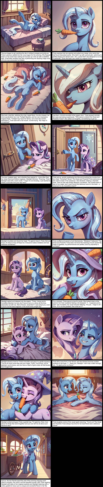

# Generate a sloppy comic from a structured prompt

### Description:
Using IPAdapter for style consistency, the node accepts a story structured as text {prompt} text {prompt} etc. and generates a comic, saving it to /output. It also adds LLM API Request node, providing an openai compatible LLM API for generating the stories. 

### Installation and usage:
- First install https://github.com/cubiq/ComfyUI_IPAdapter_plus, follow the installation instructions closely. Make sure to get ip-adapter-plus_sdxl_vit-h.safetensors SDXL plus model.
- After installing IPAdapter, go to custom_nodes and git clone this repo.
- Use the provided workflow
- You may be missing a custom node I used for previewing text, install it using "install missing custom nodes"

If you don't want to use a language model you can write stories yourself, just make sure they stick to the format described above.
Also, LLM API node seed doesn't do anything.

