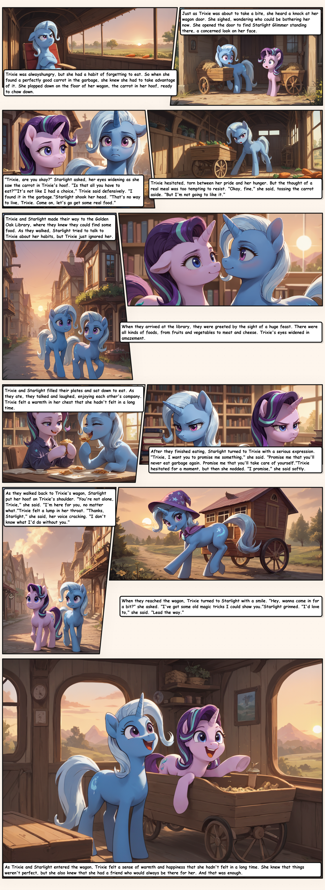

# Generate a sloppy comic from a structured prompt

### Description:
Introduces Generate Comic node and LLM API Request node. Currently only supports SDXL-derived models.
Generate Comic node accepts a story structured as text {prompt} text {prompt} etc. and returns a comic.
LLM API Request node is used for prompting a language model to write the comic, hosted locally or on a remote server. Below are two example configurations:

### Installation and usage:
- pip install playwright opencv-python
- Clone this repo to custom_nodes
- (Optional) For improved style consistency, install https://github.com/cubiq/ComfyUI_IPAdapter_plus. Make sure to get ip-adapter-plus_sdxl_vit-h.safetensors SDXL plus model.
- Use the provided workflow. If you skipped the last step, delete the three nodes at the top.
- You may be missing a custom node I used for previewing text, install it using "install missing custom nodes"

### Generete Comic parameters:
- width: The width of the comic, basically resolution
- squares_per_row: How many square images fit in one row. The remaining space gets filled by rescaling the images. I recommend keeping this value between 2 and 4.
- bg_color: Hex for comic's background color
- caption_positioning: The corner where the text is put. Can be any of 'tr', 'tl', 'br', 'bl', 'auto', which stand for Top right, top left, you get it. 'auto' will place it in the least detail-dense corners.
- shear: How much the images are 'tilted'. Note that the higher this value is, the more data is lost due to images being zoomed in more. Whether a row is tilted or not and the direction of the tilt is chosen at random for simplicity.

If you don't want to use a language model you can write stories yourself, just make sure they stick to the format described above.
Also, LLM API node seed doesn't do anything.

